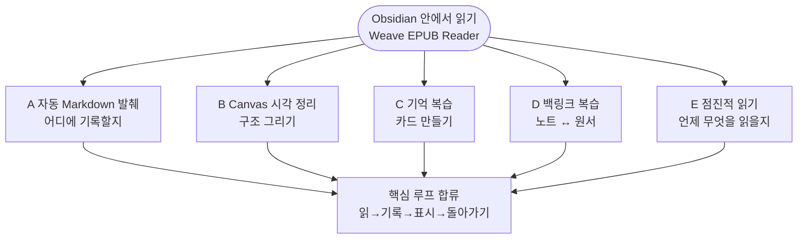

# Weave EPUB Reader

[中文](./README.zh-CN.md) | [繁體中文](./README.zh-TW.md) | [English](./README.md#english-documentation) | [日本語](./README.ja.md) | [한국어](./README.ko.md) | [Русский](./README.ru.md)

---

## 소개

**Obsidian을 메모 보관함이 아니라, 실제로 책을 읽는 공간**으로 쓰고 싶다면 Weave EPUB Reader를 추천합니다.

읽으면서 Markdown에 문장을 남기는 분, Canvas에 발췌를 정리하는 연구자, Weave로 간격 반복 카드를 만드는 분, 여러 권을 월간 캘린더로 진행하고 싶은 분——「10권 열어 두고 한 페이지씩」이 아니라 계획적으로 읽고 싶을 때 적합합니다.

시작은 가볍습니다. Vault에 EPUB을 넣고, 책장에서 열고, 텍스트를 선택해 발췌하면 됩니다. 각 발췌에는 원서 위치 정보가 붙습니다. 노트를 편집·삭제·색 변경하면 본문 하이라이트도 함께 갱신됩니다. 자동 발췌, Canvas, 카드, 백링크, 점진적 읽기 다섯 가지 워크플로는 아래 [발췌 및 노트 워크플로](#발췌-및-노트-워크플로)를 참고하세요. 자신의 습관에 맞는 경로를 고르면 됩니다.

## 핵심 기능

- **지원 플랫폼**: 데스크톱(Windows, macOS, Linux) 및 모바일(iOS, Android)
- **UI 언어**: 简体中文, 繁體中文, English, 日本語, 한국어, Русский(기본은 Obsidian 따름; 리더 설정에서 고정 가능)
- **지원 형식**: Vault 내 EPUB, MOBI, AZW3, FB2, FBZ(`fb2.zip`), CBZ, TXT 등(이름은 EPUB이지만 EPUB 전용은 아님)
- **발췌 및 노트**: 5색 하이라이트, 밑줄·취소선·물결선 등 스타일, 주석, Markdown / Canvas / Weave 덱 자동 또는 수동 기록, 본문 반영, 노트 변경 시 하이라이트 동기화
- **양방향 추적 및 앵커**: 도서 딥링크, 노트에서 원문 단락으로 이동, 리더 내 하이라이트에서 소스 노트 / Canvas / 덱으로
- **단락 읽기 모드**: 한 단락에 집중한 읽기, 단락 내 페이지 넘김 및 단락 간 탐색
- **기타**: 책장과 목차, 페이지 넘김/연속 스크롤, 판형과 테마, 읽기 진행률 및 남은 시간 추정, 점진적 읽기 캘린더, 각주 미리보기, 북마크, 챕터 내보내기, 스크린샷, Canvas 연동, AI 진입점

기능 구분은 [기본 체험과 프리미엄 지원](#기본-체험과-프리미엄-지원)을 참고하세요.

최소 Obsidian 버전: **1.8.7**

## 발췌 및 노트 워크플로

아래 다이어그램은 전체 구조 요약입니다(Mermaid는 **GitHub**와 **Obsidian** 모두에서 렌더링됩니다).

### 그림 1 · 워크플로 선택(목표별)

Obsidian 안에서 읽는 것이 중심이며, 바깥쪽 각 가지는 목표에 따른 전형적인 경로입니다.

### 그림 2 · 점진적 읽기 하위 흐름(워크플로 E)

**여러 권을 일정에 맞춰 진행하는 방법**을 다루며, 자동 발췌(워크플로 A)과 보완 관계입니다: **E가 챕터 일정, A가 기록 내용**을 담당합니다.

### 다섯 가지 전형적인 워크플로

#### A. 자동 Markdown 발췌(가장 일반적)

**읽으면서 노트를 주 전장으로 쓰는** 경우에 적합:

1. **먼저** Markdown 노트를 발췌 노트로 열고, 삽입할 위치에 커서를 둡니다(분할 화면이 가장 좋음).
2. 리더를 열고 툴바의 **자동 모드**를 켭니다(번개 아이콘: 켜짐 = 삽입, 꺼짐 = 클립보드 복사).
3. 책에서 텍스트를 선택해 발췌 → 위치 정보가 있는 발췌 블록(도서 딥링크 포함)이 **해당 커서 위치에 자동 삽입**됩니다.
4. 노트를 저장한 뒤 같은 책을 다시 열면, 해당 단락에 **본문 하이라이트가 표시**됩니다——노트에 기록한 내용이 책을 열면 보입니다.

자세히: [README(简体中文) · 워크플로 A](./README.md#a-自动-markdown-摘录最常用).

#### B. Canvas 시각 정리

**주제 정리, 구조 시각화, 논점 관계 파악**에 적합:

1. 현재 책에 Canvas 파일을 **연결**합니다.
2. 자동 모드를 켜면 발췌가 **Canvas 새 노드에 자동 기록**될 수 있습니다(배치 방향 설정 가능).
3. Canvas에서 노드를 배치·연결·그룹화; 리더는 연결된 Canvas의 발췌를 **본문에 반영**합니다.

#### C. 기억 복습

발췌를 **간격 반복**에 넣고 싶을 때 적합:

1. 텍스트 선택 → 툴바 **카드 만들기** → Weave 카드 편집기.
2. `.wdeck` 등 덱 파일에 저장; 리더는 덱 데이터에서 **하이라이트를 반영**합니다.
3. Weave에서 복습; 필요하면 원서 단락으로 돌아갈 수 있습니다.

#### D. 백링크 복습

**먼저 발췌, 나중에 복습, 원문으로 돌아가기** 흐름에 적합:

1. Markdown / Canvas / 덱에서 과거 발췌 확인; 책을 열면 **본문에 하이라이트 표시**.
2. 노트의 도서 딥링크 클릭 → **원문 단락**으로 이동.
3. 리더에서 하이라이트 클릭 → **소스 노트를 한 번에 찾기**(양방향 추적).

#### E. 점진적 읽기: 여러 권 교차·깊이 읽기

**한 권을 끝까지 한 번에 읽기보다, 여러 권을 리듬 있게 진행**하고 싶을 때 적합:

1. **현재 챕터를 점진적 읽기에 추가**: 리더 사이드바 **목차**에서 챕터에 **「점진적 읽기에 추가」** 사용(점진적 읽기 주제 선택 가능).
2. **월간 캘린더에서 통합 일정**: 챕터는 Weave **점진적 읽기 월간 캘린더**에 나타나, 다른 책·챕터의 읽기 포인트와 함께 일정 잡기——책장에 여러 권을 반쯤 연 채 두는 대신 **여러 권 교차 읽기** 실현.
3. **얕게 읽지 않고 깊이 읽기**:  
   - 텍스트 선택 → **점진적 읽기 포인트** 생성(EPUB 소스 딥링크 유지);  
   - 읽는 중 **점진적 읽기 이어 읽기 포인트** 표시, 다음에는 점진적 읽기 흐름에서 **책의 정확한 위치**로 한 번에 복귀.  
4. 예정일에 캘린더 또는 작업 목록에서 해당 항목 열기 → 딥링크로 챕터·단락으로 돌아가 발췌·백링크 워크플로와 연결.

워크플로 A(읽으며 기록)와 보완: **A는 「어디에 기록할지」, E는 「언제 어떤 챕터를 읽을지, 여러 권을 어떻게 교차할지」**를 담당합니다.

### 「외부 리더 + 수동 붙여넣기」와 비교

- **컨텍스트 전환 감소**: 한 문장을 기록하려고 Obsidian을 떠날 필요 없음.
- **발췌가 Vault에 축적·검색 가능**: Markdown / Canvas / 덱 안에 있고, 클립보드 기록에 흩어지지 않음.
- **복습할 때도 원문이 곁에**: 노트는 색인, 책은 현장; 딥링크와 본문 반영으로 연결.
- **기기 간 동일 워크플로**: 책과 노트는 Vault에 있으며 Obsidian 동기화 설정을 따름.
- **장편·여러 권에 리듬**: 챕터를 점진적 읽기 캘린더에 넣어 일정에 맞춰 교차 진행.

더 자세히: [README(简体中文) · 발췌 워크플로](./README.md#摘录笔记工作流), [핵심 기능](./README.md#核心能力).

## 기본 체험과 프리미엄 지원

| 기능 | 기본 체험 | 프리미엄 지원 |
|------|:--------:|:------------:|
| **전 플랫폼**(데스크톱 및 모바일) | ✅ | ✅ |
| **EPUB** 읽기, 목차, 페이지 넘김/스크롤, 판형 및 테마 | ✅ | ✅ |
| **TXT** 일반 텍스트 도서 | ✅ | ✅ |
| **MOBI / AZW3 / FB2 / FBZ / CBZ** | 🔒 | ✅ |
| **5색 하이라이트**, 주석, 발췌, **본문 반영** | ✅ | ✅ |
| **밑줄 / 취소선 / 물결선** 스타일 | 🔒 | ✅ |
| **양방향 추적**(앵커 이동, 리더 ↔ 노트 / Canvas / 덱) | 🔒 | ✅ |
| **단락 읽기 모드**, 참조 읽기 포인트 | 🔒 | ✅ |
| **읽기 진행률**, 책장 진행률, 마지막 읽기 위치, 남은 시간 추정 | ✅ | ✅ |
| **현재 페이지 북마크**, 북마크 폴더, 목록에서 이동 | ✅ | ✅ |
| **Canvas** 연동 및 자동 노드 생성 | 🔒 | ✅ |
| 각주 호버 미리보기, 현재 챕터 Markdown 내보내기 | 🔒 | ✅ |

> 범례: ✅ 포함 · 🔒 프리미엄 지원 필요

- **프리미엄 지원 활성화**: 리더 설정에서 EPUB 전용 라이선스 사용, 또는 **Weave** 메인 플러그인이 활성화되어 있으면 라이선스 상속 가능.
- **카드 만들기 / 점진적 읽기 / AI**: EPUB 프리미엄 라이선스 슬롯은 별도로 필요 없지만 Weave 필요; AI는 자체 API 키 필요.

공식 대조표: [README(简体中文) · 기능 대조](./README.md#基础体验与高级支持). 리더 설정에서 활성화. 약관: [PREMIUM_TERMS.md](./PREMIUM_TERMS.md).

## 설치

### 방법 1: 커뮤니티 플러그인(권장)

1. **설정 → 커뮤니티 플러그인 → 찾아보기** 열기
2. **Weave EPUB Reader** 검색 후 설치 및 활성화

### 방법 2: 수동 설치

1. [GitHub Releases](https://github.com/zhuzhige123/obsidian-weave-reader/releases)에서 `manifest.json` 버전과 일치하는 릴리스 다운로드:
   - `main.js`
   - `manifest.json`
   - `styles.css`
2. `.obsidian/plugins/weave-epub-reader/`에 복사
3. Obsidian 재시작 후 **설정 → 커뮤니티 플러그인**에서 **Weave EPUB Reader** 활성화

## 빠른 시작

1. 리본 또는 명령 팔레트에서 **책장**을 열고 Vault에서 책 가져오기 또는 열기.
2. 텍스트를 선택해 하이라이트, 발췌, 북마크 만들기.
3. 툴바로 챕터 이동, 표시 설정, 내보내기.
4. 리더 메뉴 → **도움말** → **튜토리얼**에서 앱 내 가이드. 워크플로 상세는 위 [발췌 및 노트 워크플로](#발췌-및-노트-워크플로) 참고.

## 데이터 및 동기화

**동기화 권장(Vault 내)**: 도서 파일, Markdown 발췌, Canvas, Weave 덱 데이터.

**보통 로컬(플러그인 폴더)**: 리더 캐시, 인덱스, 일부 UI 상태. 기기 간에는 Vault 내용 동기화를 우선하고, `.obsidian/plugins/weave-epub-reader/` 캐시 파일은 직접 동기화하지 않는 것을 권장.

## 개인정보 및 네트워크

- 읽기, 렌더링, 발췌, 백링크는 **기본적으로 로컬** 처리; Vault 내용은 능동적으로 업로드되지 않음.
- 책장, 백링크, 소스 찾기 기능은 로컬에서 Vault 파일 경로 열거; 발췌 또는 활성화 코드 복사 시 클립보드 접근. [PRIVACY.md](./PRIVACY.md) 참고.
- **프리미엄 지원 활성화**는 라이선스 서비스에 연결될 수 있음(활성화 코드, 이메일, 기기 지문 요약 등). [PRIVACY.md](./PRIVACY.md) 참고.
- **AI 기능**은 사용자가 설정한 서드파티 서비스를 호출.

## 자주 묻는 질문

### 본문에 발췌 하이라이트가 안 보여요?

발췌가 이 플러그인으로 만들어졌고 Markdown / Canvas / Weave 덱 데이터에 있으며, **같은 책**을 열었는지 확인하세요. 소스 파일을 최근 수정했다면 잠시 후 자동 새로고침됩니다.

### Weave와의 관계는?

**Weave EPUB Reader는 단독으로 동작합니다**: [Weave](https://github.com/zhuzhige123/anki-obsidian-plugin) 메인 플러그인 없이도 Obsidian에서 EPUB 읽기, 책장 사용, 기본 발췌 및 본문 반영이 가능합니다. Weave를 설치하면 간격 반복 카드, 점진적 읽기 캘린더, AI 메뉴 등에 연결하고 Weave 라이선스를 상속해 프리미엄 지원을 활성화할 수 있습니다. 둘은 **선택적 연동**이며 필수 의존은 아닙니다.

### 발췌 노트를 전 플랫폼에서 동기화할 수 있나요?

**예.** 발췌는 Vault 내 Markdown, Canvas, 덱 등에 저장되며, Obsidian Sync, iCloud, Vault 동기화 등 사용 중인 동기화 방식에 따라 데스크톱과 모바일 간 일치합니다. Vault 내용 동기화 권장; 리더 캐시 등 플러그인 폴더 데이터는 보통 기기 간 동기화 불필요(위 [데이터 및 동기화](#데이터-및-동기화) 참고).

### 노트를 내보낼 수 있나요?

**예.** 발췌 및 하이라이트 데이터는 Vault에 저장되며 Obsidian에서 직접 보기·편집·Markdown 내보내기 가능; 리더에도 챕터 내보내기 등 기능이 있습니다. **데이터는 기본적으로 완전 로컬**이며 Vault 내용은 능동적으로 업로드되지 않습니다.

### 프리미엄은 왜 유료인가요?

프리미엄 지원은 **지속적인 개발을 지원**하기 위함입니다——개발자가 장기적으로 읽기·발췌 경험을 다듬을 수 있도록. **기본 체험은 무료**이며 일상 읽기, 5색 하이라이트, 주석, 발췌, 본문 반영 등 핵심 기능은 무료로 충분합니다. 다양한 형식, 양방향 추적, 단락 읽기 모드 등 고급 기능이 필요할 때만 프리미엄 지원을 활성화하세요.

### 구독인가요, 일회 구매인가요?

프리미엄 지원은 **일회 구매**(한 번 활성화하면 장기 사용; [프리미엄 지원 약관](./PREMIUM_TERMS.md) 참고)이며 월 구독이 아닙니다.

### MOBI / AZW3 / FB2 등을 열 수 없어요?

**EPUB과 TXT**는 기본 체험에 포함됩니다. **MOBI, AZW3, FB2, FBZ, CBZ** 등은 프리미엄 지원 필요. 위 [기본 체험과 프리미엄 지원](#기본-체험과-프리미엄-지원) 참고.

### 플러그인 폴더 이름은?

플러그인 ID: `weave-epub-reader` → `.obsidian/plugins/weave-epub-reader/`

## 추가 문서

- [플러그인 소개(简体中文)](./README.md#中文文档)
- [플러그인 소개(繁體中文)](./README.zh-TW.md)
- [개인정보](./PRIVACY.md) · [프리미엄 지원 약관](./PREMIUM_TERMS.md) · [지원](./SUPPORT.md) · [보안](./SECURITY.md)

## 라이선스 및 작성자

소스 코드는 [GPL-3.0-or-later](LICENSE)로 공개됩니다.

- Author: Rabbit (zhuzhige)
- GitHub: https://github.com/zhuzhige123
