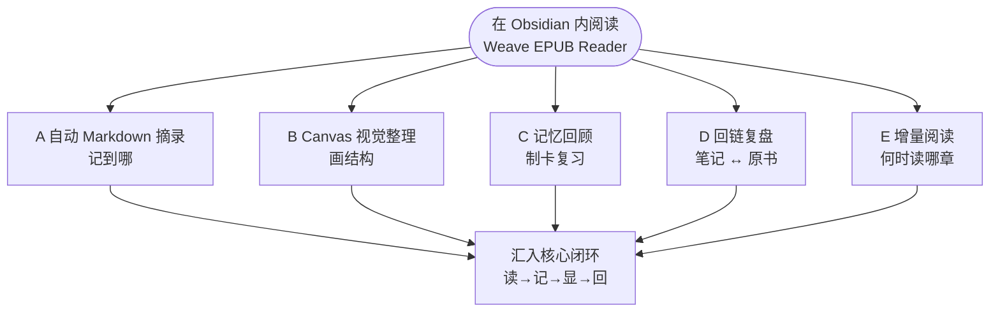
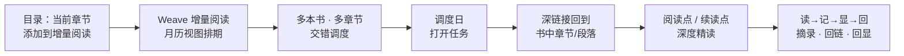
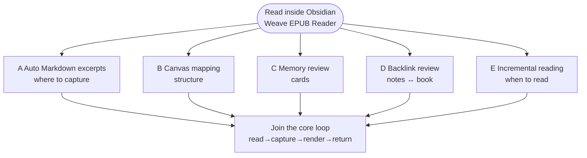
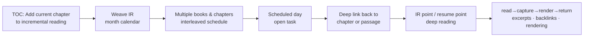

# Weave EPUB Reader

[中文](#中文文档) | [繁體中文](./README.zh-TW.md) | [English](#english-documentation) | [日本語](./README.ja.md) | [한국어](./README.ko.md) | [Русский](./README.ru.md)

---

## 中文文档

### 插件介绍

如果你希望 **Obsidian 不只是笔记仓库，也是你正经读书的地方**，可以试试 Weave EPUB Reader。

它适合：边读边把句子记进 Markdown 的人；做专题研究、想把摘录画进 Canvas 的人；用 Weave 做间隔复习、想把书中段落制成卡片的人；同时推进多本书、需要月历排期而不是「开十本读半页」的人。

上手很轻：把 EPUB 放进 Vault，从书架打开，选中文字即可摘录。摘录会带着回到原书的位置信息；你改笔记、删摘录或换颜色，书里的高亮也会跟着变。更完整的五条工作流（自动摘录、Canvas、制卡、回链、增量阅读）见下方 [摘录笔记工作流](#摘录笔记工作流) 图示——按自己的习惯选一条路走即可。

## 核心能力

- **支持平台**：桌面端（Windows、macOS、Linux）与移动端（iOS、Android）
- **界面语言**：简体中文、繁體中文、English、日本語、한국어、Русский（默认跟随 Obsidian，可在阅读器设置中固定）
- **阅读格式**：Vault 内 EPUB、MOBI、AZW3、FB2、FBZ（`fb2.zip`）、CBZ、TXT 等（名称含 EPUB，但不仅限于 EPUB）
- **摘录笔记**：五种高亮颜色，以及下划线、删除线、波浪线等样式标注；想法；自动或手动写入 Markdown / Canvas / Weave 牌组；正文回显；笔记删改、改色后书中高亮同步更新
- **双向溯源与定位**：书籍深链接锚点；笔记跳回原文段落；阅读器内点击高亮反查来源笔记 / Canvas / 牌组
- **段落阅读模式**：单段沉浸阅读、段内翻页与跨段导航
- **其它**：书架与目录、分页/连续滚动、版式主题；阅读进度与剩余时间估算；增量阅读月历排期；脚注浮窗；书签、章节导出、截图、Canvas 绑定；AI 入口

各能力在 [基础体验与高级支持](#基础体验与高级支持) 中的划分见下表。

最低 Obsidian 版本：**1.8.7**

## 摘录笔记工作流

下方图示概括整体结构（GitHub / Obsidian 均可渲染 Mermaid）。

### 图 1 · 五条工作流怎么选（按目标分流）

中心是「在 Obsidian 内读书」；向外是按目标选择的五条典型路径。

### 图 2 · 增量阅读子流程（工作流 E）

解决「**多本书如何交错推进、长书如何按章深度读**」，与自动摘录（工作流 A）互补：**E 管排期，A 管记下什么**。

### 五条典型工作流

#### A. 自动 Markdown 摘录（最常用）

适合「边读边记、笔记就是主战场」：

1. **先**打开一本 Markdown 作为摘录笔记本，光标放在要插入的位置（与阅读器分屏体验最佳）。
2. 打开阅读器，开启工具栏 **自动模式**（闪电图标：开 = 插入，关 = 复制到剪贴板）。
3. 在书中选中文本并摘录 → 带定位的摘录块（含书籍深链接）**自动插入到上一步光标处**。
4. 保存笔记后，再次打开该书，正文会在对应段落**回显高亮**——你在笔记里记过什么，打开书就能看见。

详见上文 [工作流 A](#a-自动-markdown-摘录最常用)。

#### B. Canvas 视觉整理

适合「做专题、画结构、理清论点关系」：

1. 为当前书**绑定**一个 Canvas 文件。
2. 开启自动模式后，摘录可**自动写入 Canvas 新节点**（可调整节点排布方向）。
3. 在 Canvas 里拖拽、连线、分组；阅读器识别绑定 Canvas 中的摘录并**回显到正文**。

#### C. 记忆回顾

适合「摘录之后要复习、要间隔重复」：

1. 选中文本 → 工具栏 **制卡**，进入 Weave 记忆卡片窗口。
2. 保存到 `.wdeck` 等牌组文件后，阅读器从牌组数据**回显高亮**。
3. 在 Weave 记忆模块中按牌组规则做复习；需要时仍可回到书中原文。

#### D. 回链复盘

适合「先摘录、后复习、再回原文」：

1. 在 Markdown / Canvas / 牌组笔记里查看历史摘录；打开书时正文侧已有**回显高亮**。
2. 点击笔记中的书籍深链接 → 跳回**原文段落**。
3. 在阅读器里点击某条高亮 → **一键定位到来源笔记**，完成「笔记 ↔ 原书」双向溯源。

#### E. 增量阅读：多书交错与深度精读

适合「**不想一次读完一本**、而是多本书按节奏交错推进，并在月历里看见整体阅读计划」：

1. **把当前章节加入增量阅读**：在阅读器侧边栏 **目录** 中，对某一章使用 **「添加到增量阅读」**（可选择一个增量阅读专题），将该章纳入增量阅读任务。
2. **进入月历视图统一调度**：章节会出现在 Weave **增量阅读月历视图** 中，与来自其他书籍、其他章节的阅读点一起排期——实现 **多本书的交错阅读**，而不是在书架里同时开很多本却都读不深。
3. **深度阅读而非浅尝辄止**：  
   - 选中文本 → 创建 **增量阅读点**（保留 EPUB 溯源深链接），把段落级内容纳入后续处理；  
   - 阅读过程中可标记 **增量阅读续读点**，下次从增量阅读流程**一键回到书中精确位置**继续。  
4. 到调度日时，从月历或任务列表打开对应项 → 经深链接回到原书章节/段落，与摘录、回链工作流衔接。

这与工作流 A（边读边记）互补：**A 解决「记到哪」；E 解决「何时读哪一章、多本书如何轮流推进」**。

### 和「只用外部阅读器 + 手动粘贴」相比

- **少一次上下文切换**：不必为了记一句而离开 Obsidian。
- **摘录可沉淀、可检索**：内容在 Vault 的 Markdown / Canvas / 牌组里，而不是散落在剪贴板历史里。
- **复习时原文仍在场**：笔记是索引，书是现场；两者通过深链接与正文回显连在一起。
- **多端一致**：书与笔记都在 Vault 里，随 Obsidian 同步策略走；手机读、桌面整理可以同一条链路。
- **长书与多书有节奏**：章节可进入增量阅读月历，按调度交错阅读，而不是靠意志力硬啃单本。

更完整的操作说明见上文 [摘录笔记工作流](#摘录笔记工作流) 与 [核心能力](#核心能力)。

## 基础体验与高级支持

| 能力 | 基础体验 | 高级支持 |
|------|:--------:|:--------:|
| **全平台**阅读（桌面端与移动端） | ✅ | ✅ |
| 阅读 **EPUB**，目录跳转、翻页/滚动、版式与主题 | ✅ | ✅ |
| 阅读 **TXT** 纯文本书籍 | ✅ | ✅ |
| 阅读 **MOBI / AZW3 / FB2 / FBZ / CBZ** | 🔒 | ✅ |
| **五种高亮色**、想法、摘录与**正文回显** | ✅ | ✅ |
| **下划线 / 删除线 / 波浪线**等样式标注 | 🔒 | ✅ |
| **双向溯源**（锚点跳转、笔记 ↔ 原书定位显示） | 🔒 | ✅ |
| **段落阅读模式**、参考阅读点 | 🔒 | ✅ |
| **阅读进度**持久化、书架进度、最后阅读点、剩余阅读时间 | ✅ | ✅ |
| **当前页书签**、书签目录与书签列表跳转 | ✅ | ✅ |
| **Canvas** 绑定与自动写入节点 | 🔒 | ✅ |
| 脚注浮窗预览、导出当前章节为 Markdown | 🔒 | ✅ |

> 图例：✅ 已包含 · 🔒 需启用高级支持

- **启用高级支持**：在阅读器设置中使用 EPUB 独立激活码；若已安装并激活 **Weave 主插件**，可继承授权而无需重复输入。
- **制卡 / 增量阅读 / AI**：不单独占用阅读器高级支持许可，但需安装 Weave；AI 另需自行配置 API Key。

完整对照见上文 [基础体验与高级支持](#基础体验与高级支持)；激活在阅读器设置中完成，条款见 [PREMIUM_TERMS.md](./PREMIUM_TERMS.md)。

## 安装

### 方式一：社区插件（推荐）

1. 打开 **设置 → 社区插件 → 浏览**
2. 搜索 **Weave EPUB Reader**，安装并启用

### 方式二：手动安装

1. 从 [GitHub Releases](https://github.com/zhuzhige123/obsidian-weave-reader/releases) 下载与 `manifest.json` 版本号一致的发布包，获取：
   - `main.js`
   - `manifest.json`
   - `styles.css`
2. 复制到 `.obsidian/plugins/weave-epub-reader/`
3. 重启 Obsidian，在 **设置 → 社区插件** 中启用 **Weave EPUB Reader**

## 快速开始

1. 启用插件后，通过功能区图标或命令面板打开**书架**，从 Vault 导入或打开图书。
2. 在阅读器中选中文本，创建高亮、摘录或书签。
3. 使用工具栏进行章节跳转、显示设置与导出。
4. 阅读器菜单 → **帮助** → **使用教程** 可查看插件内精简教程。工作流细节见上文 [摘录笔记工作流](#摘录笔记工作流)。

## 数据与同步

**建议同步（位于 Vault）**：图书文件、Markdown 摘录、Canvas、Weave 牌组数据，以及每本书的进度与书签专有笔记（默认 `weave/epub-bookmarks/data_*.md`）。

**通常不需跨设备同步（位于插件目录）**：阅读缓存、索引、Canvas 绑定与参考阅读点等本地状态。多设备使用时优先同步 Vault 内容，而非直接同步 `.obsidian/plugins/weave-epub-reader/` 下的缓存文件。

## 隐私与网络

- 阅读、渲染、摘录与回链等**默认在本地完成**，不会主动上传 Vault 内容。
- 书架、回链与来源定位等功能会在本地枚举 Vault 文件路径；复制摘录或激活码时会访问剪贴板。详见 [PRIVACY.md](./PRIVACY.md)。
- **高级支持激活**可能访问许可证服务（激活码、邮箱、设备指纹摘要等），详见 [PRIVACY.md](./PRIVACY.md)。
- **AI 功能**会调用你自行配置的第三方服务。

## 常见问题

### 正文没有显示摘录高亮？

确认摘录由本插件生成、位于 Markdown / Canvas / Weave 牌组文件中，且打开的是**同一本书**。来源文件刚修改时，稍等片刻会自动刷新。

### 与 Weave 的关系？

**Weave EPUB Reader 可独立使用**：不安装 [Weave](https://github.com/zhuzhige123/anki-obsidian-plugin) 主插件，也能在 Obsidian 里阅读 EPUB、管理书架，并完成基础摘录与正文回显。安装 Weave 后，可额外衔接制卡复习、增量阅读月历、AI 菜单等能力，并可继承 Weave 授权以启用阅读器高级支持。二者是**可选联动**，不是硬性依赖。

### 摘录笔记能否全平台同步？

**支持。** 摘录落在 Vault 内的 Markdown、Canvas、牌组等文件中，会随你使用的 Obsidian 同步方式（官方 Sync、iCloud、网盘同步 Vault 等）在桌面端与移动端之间保持一致。建议同步 Vault 内容；阅读器缓存等插件目录数据通常无需跨设备同步（见上文 [数据与同步](#数据与同步)）。

### 是否支持导出笔记？

**支持。** 摘录与高亮相关数据保存在你的库内，可在 Obsidian 中直接查看、编辑与导出 Markdown；阅读器也提供章节导出等能力。**数据默认完全本地化**，不会主动上传你的 Vault 内容。

### 为何提供高级付费？

高级支持用于**支持持续开发**——让开发者能长期投入、打磨阅读与摘录细节。**基础体验免费**，已覆盖日常阅读、五色高亮、想法、摘录与正文回显等核心能力，上手体验完整；若你需要多格式、双向溯源、段落阅读模式等进阶能力，再按需启用高级支持即可。

### 是订阅还是买断？

阅读器高级支持采用**买断制**（一次激活，长期使用，具体以 [高级支持条款](./PREMIUM_TERMS.md) 为准），而非按月订阅。

### 非 EPUB 格式打不开？

**EPUB 与 TXT** 在基础体验中即可阅读；**MOBI、AZW3、FB2、FBZ、CBZ** 等需启用高级支持。详见上文 [基础体验与高级支持](#基础体验与高级支持)。

### 插件文件夹名称？

插件 ID 为 `weave-epub-reader`，路径：`.obsidian/plugins/weave-epub-reader/`

## 更多文档

- [插件介绍（简体中文）](#中文文档)
- [插件介绍（繁體中文）](./README.zh-TW.md)
- [隐私说明](./PRIVACY.md) · [高级支持条款](./PREMIUM_TERMS.md) · [支持](./SUPPORT.md) · [安全](./SECURITY.md)

## 许可证与作者

源码基于 [GPL-3.0-or-later](LICENSE) 发布。

- Author: Rabbit (zhuzhige)
- GitHub: https://github.com/zhuzhige123

---

## English Documentation

### Introduction

If you want **Obsidian to be more than a note archive—a place where you actually read**—Weave EPUB Reader is worth a look.

It fits readers who capture sentences into Markdown as they go; researchers who map excerpts onto Canvas; Weave users who turn passages into cards for spaced repetition; and anyone juggling several books who prefers a month-calendar rhythm over “ten books open, half a page each.”

Getting started is light: put an EPUB in your vault, open it from the bookshelf, select text, and excerpt. Each capture keeps a link back to the same passage in the book; when you edit, delete, or recolor notes, highlights in the text update to match. Five fuller paths—auto excerpts, Canvas, cards, backlinks, incremental reading—are diagrammed in [Excerpt and note workflows](#excerpt-and-note-workflows) below; follow the one that matches your habit.

## Core capabilities

- **Platforms**: Desktop (Windows, macOS, Linux) and mobile (iOS, Android)
- **Interface languages**: Simplified Chinese, Traditional Chinese, English, Japanese, Korean, Russian (follow Obsidian by default; can be fixed in reader settings)
- **Formats**: EPUB, MOBI, AZW3, FB2, FBZ (`fb2.zip`), CBZ, TXT, and more in the vault (despite the name, the plugin is not EPUB-only)
- **Excerpts and notes**: Five highlight colors plus underline, strikethrough, and wavy underline; annotations; auto or manual capture to Markdown, Canvas, or Weave decks; in-body rendering; highlights refresh when notes change
- **Two-way tracing and anchors**: Book deep links; jump from notes to the original passage; open the source note, Canvas, or deck from a highlight in the reader
- **Paragraph reading mode**: Immersive single-paragraph view with in-paragraph paging and cross-paragraph navigation
- **More**: Bookshelf and TOC, paginated or continuous scrolling, typography and themes; reading progress and remaining-time estimates; incremental reading calendar; footnote hover preview; bookmarks, chapter export, screenshots, Canvas binding; AI entry points

See [Essential experience and Premium support](#essential-experience-and-premium-support) for how capabilities are grouped.

Minimum Obsidian version: **1.8.7**

## Excerpt and note workflows

The diagrams below summarize the structure (Mermaid renders on **GitHub** and in **Obsidian**).

### Diagram 1 · Pick a workflow (goal-based map)

Reading in Obsidian is the hub; each branch is a typical path you can follow by goal.

### Diagram 2 · Incremental reading subflow (workflow E)

Answers **how several books advance on a schedule** and complements auto excerpts (workflow A): **E schedules chapters; A captures what you noted**.

### Five typical workflows

#### A. Auto Markdown excerpts (most common)

Best when **notes are your primary workspace while reading**:

1. **First**, open a Markdown note as your excerpt notebook and place the cursor where inserts should go (split view works best).
2. Open the reader and turn on **Auto mode** in the toolbar (lightning icon: on = insert, off = copy to clipboard).
3. Select text in the book and excerpt → a located excerpt block (with a book deep link) is **inserted at that cursor**.
4. After saving the note, reopen the book: matching passages show **highlights in the body**—what you captured in notes is visible in the book.

See [workflow A](#a-auto-markdown-excerpts-most-common) above.

#### B. Canvas visual mapping

Best for **topics, structure, and relationships**:

1. **Bind** a Canvas file to the current book.
2. With Auto mode on, excerpts can **auto-create Canvas nodes** (layout direction is configurable).
3. Arrange nodes in the Canvas; the reader **renders related excerpts back into the book**.

#### C. Memory review

Best when excerpts should enter **spaced repetition**:

1. Select text → **Make card** in the toolbar → Weave card editor.
2. Save to `.wdeck` or other deck files; the reader **renders highlights from deck data**.
3. Review in Weave; jump back to the book when you need the original passage.

#### D. Backlink review

Best for **excerpt first, review later, return to source**:

1. Review past excerpts in Markdown / Canvas / decks; reopen the book to see **highlights in the body**.
2. Click a book deep link in a note → jump to the **original passage**.
3. Click a highlight in the reader → **open the source note** (two-way tracing).

#### E. Incremental reading: interleaved multi-book deep reading

Best when you want **several books to advance on a rhythm** instead of reading one cover-to-cover in a single sprint:

1. **Add the current chapter to incremental reading**: In the reader sidebar **table of contents**, use **Add to incremental reading** on a chapter (optionally pick an incremental-reading topic) to enqueue that chapter.
2. **Schedule in the month calendar**: The chapter appears in Weave’s **incremental reading month calendar** alongside reading points from other books and chapters—**interleaved multi-book reading** instead of leaving many books half-open on the shelf.
3. **Deep reading, not skimming**:  
   - Select text → create an **incremental reading point** (keeps an EPUB source deep link) for paragraph-level follow-up;  
   - While reading, mark an **incremental reading resume point** so the next IR session jumps back to the **exact location** in the book.  
4. On a scheduled day, open the item from the calendar or task list → follow the deep link back to the chapter or passage, then continue with excerpts and backlinks.

This complements workflow A: **A is where captures go; E is when each chapter gets read across multiple books.**

### Compared with “external reader + manual paste”

- **Fewer context switches**—no leaving Obsidian to capture a sentence.
- **Excerpts become durable vault knowledge**—searchable in Markdown, Canvas, or decks—not clipboard history.
- **Review keeps the source in view**—notes index what you read; the book shows the live context via deep links and rendering.
- **Same workflow across devices**—books and notes live in the vault and follow your Obsidian sync setup.
- **Rhythm for long or multiple books**—chapters enter the incremental reading calendar for scheduled, interleaved progress.

More detail: [Excerpt and note workflows](#excerpt-and-note-workflows) and [Core capabilities](#core-capabilities) above.

## Essential experience and Premium support

| Capability | Essential experience | Premium support |
|------------|:--------------------:|:---------------:|
| **All platforms** (desktop and mobile) | ✅ | ✅ |
| Read **EPUB**, TOC, paginated/scroll modes, typography and themes | ✅ | ✅ |
| Read **TXT** plain-text books | ✅ | ✅ |
| Read **MOBI / AZW3 / FB2 / FBZ / CBZ** | 🔒 | ✅ |
| **Five highlight colors**, annotations, excerpts, and **in-body rendering** | ✅ | ✅ |
| **Underline / strikethrough / wavy underline** styling | 🔒 | ✅ |
| **Two-way tracing** (anchor jumps, reader ↔ notes / Canvas / decks) | 🔒 | ✅ |
| **Paragraph reading mode**, reference reading points | 🔒 | ✅ |
| **Reading progress**, bookshelf progress, last location, remaining-time estimates | ✅ | ✅ |
| **Current-page bookmarks**, bookmark folder, and bookmark list navigation | ✅ | ✅ |
| **Canvas** binding and automatic node creation | 🔒 | ✅ |
| Footnote hover preview; export current chapter to Markdown | 🔒 | ✅ |

> Legend: ✅ included · 🔒 requires Premium support

- **Enable Premium support**: EPUB-only license in reader settings, or inherit from an activated **Weave** main plugin.
- **Card making / incremental reading / AI**: No separate EPUB Premium-support license slot, but require Weave; AI also needs your own API key.

Authoritative breakdown: [Essential experience and Premium support](#essential-experience-and-premium-support) above. Activate in reader settings. Terms: [PREMIUM_TERMS.md](./PREMIUM_TERMS.md).

## Installation

### Option 1: Community plugins (recommended)

1. Open **Settings → Community plugins → Browse**
2. Search for **Weave EPUB Reader**, install, and enable

### Option 2: Manual installation

1. Download a [GitHub release](https://github.com/zhuzhige123/obsidian-weave-reader/releases) matching the version in `manifest.json`:
   - `main.js`
   - `manifest.json`
   - `styles.css`
2. Copy into `.obsidian/plugins/weave-epub-reader/`
3. Restart Obsidian and enable **Weave EPUB Reader** under **Settings → Community plugins**

## Quick start

1. Open the **bookshelf** from the ribbon or command palette, then import or open a book.
2. Select text to create highlights, excerpts, or bookmarks.
3. Use the toolbar for chapter navigation, display settings, and export.
4. Reader menu → **Help** → **Tutorial** for in-app guidance. For workflow details, see [Excerpt and note workflows](#excerpt-and-note-workflows) above.

## Data and sync

**Good to sync (in the vault)**: Book files, Markdown excerpts, Canvas files, Weave deck data.

**Usually local (plugin folder)**: Reader cache, indexes, some UI state. Prefer syncing vault content across devices rather than `.obsidian/plugins/weave-epub-reader/` cache files.

## Privacy and network

- Reading, rendering, excerpting, and backlinks are **local by default**; vault content is not uploaded proactively.
- Bookshelf, backlink, and source-locate features enumerate vault file paths locally; copying excerpts or activation codes uses the clipboard. See [PRIVACY.md](./PRIVACY.md).
- **Premium support activation** may contact the license service (activation code, email, device fingerprint summary, etc.). See [PRIVACY.md](./PRIVACY.md).
- **AI features** call the third-party services you configure.

## FAQ

### Excerpt highlights not showing in the book?

Confirm the excerpt was created by this plugin, lives in Markdown / Canvas / Weave deck data, and you opened the **same book**. Recent edits refresh automatically after a short delay.

### How does this relate to Weave?

**Weave EPUB Reader works on its own**: without the [Weave](https://github.com/zhuzhige123/anki-obsidian-plugin) main plugin, you can still read EPUBs, use the bookshelf, and capture excerpts with in-body rendering. With Weave installed, you can also connect spaced-repetition cards, incremental reading calendar, AI actions, and inherit Weave licensing for Premium support. The two are **optional companions**, not a hard dependency.

### Can excerpts and notes sync across platforms?

**Yes.** Captures live in Markdown, Canvas, deck files, and other vault content, so they follow whatever Obsidian sync you already use (Obsidian Sync, iCloud, cloud-synced vaults, etc.) across desktop and mobile. Sync vault content; reader cache under the plugin folder usually does not need cross-device sync (see [Data and sync](#data-and-sync) above).

### Can I export my notes?

**Yes.** Excerpt and highlight data stays in your vault—you can read, edit, and export Markdown in Obsidian, and the reader offers chapter export and related tools. **Data is local by default**; your vault is not uploaded proactively.

### Why is Premium support paid?

Premium support **funds ongoing development** so the reader and excerpt workflow can keep improving. The **essential experience is free**—daily reading, five highlight colors, annotations, excerpts, and in-body rendering are fully usable without paying. Enable Premium support only when you want formats, two-way tracing, paragraph reading mode, and other advanced capabilities.

### Subscription or one-time purchase?

Premium support is **buy-once** (activate once, use long-term; see [Premium support terms](./PREMIUM_TERMS.md)), not a monthly subscription.

### Cannot open MOBI / AZW3 / FB2?

**EPUB and TXT** are included in the essential experience. **MOBI, AZW3, FB2, FBZ, and CBZ** require Premium support. See [Essential experience and Premium support](#essential-experience-and-premium-support) above.

### Plugin folder name?

Plugin ID: `weave-epub-reader` → `.obsidian/plugins/weave-epub-reader/`

## More documentation

- [Introduction (Simplified Chinese)](#中文文档)
- [Introduction (Traditional Chinese)](./README.zh-TW.md)
- [Privacy](./PRIVACY.md) · [Premium support terms](./PREMIUM_TERMS.md) · [Support](./SUPPORT.md) · [Security](./SECURITY.md)

## License and author

Source code is released under [GPL-3.0-or-later](LICENSE).

- Author: Rabbit (zhuzhige)
- GitHub: https://github.com/zhuzhige123
