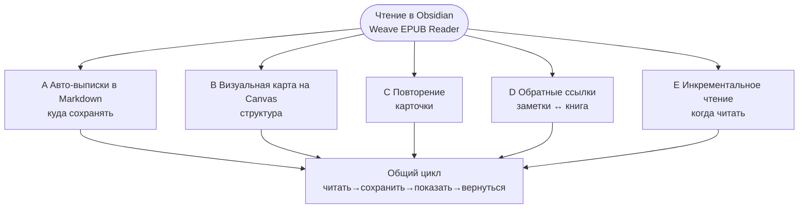

# Weave EPUB Reader

[中文](./README.zh-CN.md) | [繁體中文](./README.zh-TW.md) | [English](./README.md#english-documentation) | [日本語](./README.ja.md) | [한국어](./README.ko.md) | [Русский](./README.ru.md)

---

## Введение

Если вы хотите, чтобы **Obsidian был не только архивом заметок, но и местом, где вы действительно читаете**, попробуйте Weave EPUB Reader.

Плагин подойдёт тем, кто сохраняет цитаты в Markdown по ходу чтения; исследователям, которые выстраивают структуру на Canvas; пользователям Weave, делающим карточки для интервального повторения; и тем, кто ведёт несколько книг по календарному ритму, а не «десять книг открыто — по полстраницы в каждой».

Начать просто: положите EPUB в Vault, откройте книгу с полки, выделите текст и сделайте выписку. К каждой выписке привязывается место в книге; при редактировании, удалении или смене цвета заметок подсветка в тексте обновляется. Пять типичных сценариев — автоматические выписки, Canvas, карточки, обратные ссылки, инкрементальное чтение — описаны ниже в разделе [Рабочие процессы с выписками и заметками](#рабочие-процессы-с-выписками-и-заметками). Выберите тот, что ближе вашей привычке.

## Основные возможности

- **Платформы**: десктоп (Windows, macOS, Linux) и мобильные (iOS, Android)
- **Языки интерфейса**: 简体中文, 繁體中文, English, 日本語, 한국어, Русский (по умолчанию следует Obsidian; можно зафиксировать в настройках читалки)
- **Форматы**: EPUB, MOBI, AZW3, FB2, FBZ (`fb2.zip`), CBZ, TXT и другие в Vault (несмотря на название, плагин не ограничен только EPUB)
- **Выписки и заметки**: пять цветов подсветки, подчёркивание, зачёркивание, волнистая линия; аннотации; автоматическая или ручная запись в Markdown, Canvas или колоды Weave; отображение в тексте; синхронизация подсветки при изменении заметок
- **Двусторонняя трассировка и якоря**: глубокие ссылки на книгу; переход из заметки к исходному абзацу; открытие исходной заметки / Canvas / колоды по подсветке в читалке
- **Режим чтения по абзацам**: погружение в один абзац с постраничной навигацией внутри абзаца и между абзацами
- **Прочее**: полка и оглавление, постраничный или непрерывный скролл, типографика и темы; прогресс чтения и оценка оставшегося времени; календарь инкрементального чтения; предпросмотр сносок; закладки, экспорт главы, скриншоты, привязка Canvas; точки входа для AI

Разделение на базовый и расширенный уровень — в таблице [Базовый опыт и Premium support](#базовый-опыт-и-premium-support).

Минимальная версия Obsidian: **1.8.7**

## Рабочие процессы с выписками и заметками

Диаграммы ниже обобщают структуру (Mermaid рендерится на **GitHub** и в **Obsidian**).

### Схема 1 · Выбор рабочего процесса (по цели)

В центре — чтение в Obsidian; от него отходят типичные пути в зависимости от задачи.

### Схема 2 · Подпроцесс инкрементального чтения (процесс E)

Отвечает на вопрос **как несколько книг продвигаются по расписанию** и дополняет авто-выписки (процесс A): **E планирует главы; A фиксирует, что вы записали**.

### Пять типичных рабочих процессов

#### A. Автоматические выписки в Markdown (самый частый)

Подходит, когда **заметки — основное рабочее место во время чтения**:

1. **Сначала** откройте Markdown-заметку для выписок и поставьте курсор туда, куда нужно вставлять (удобнее всего в режиме разделённого экрана).
2. Откройте читалку и включите **Авторежим** на панели инструментов (иконка молнии: вкл. = вставка, выкл. = копирование в буфер).
3. Выделите текст в книге и сделайте выписку → блок с привязкой к месту (с глубокой ссылкой на книгу) **вставляется в позицию курсора**.
4. После сохранения заметки снова откройте книгу: на соответствующих абзацах появится **подсветка в тексте** — то, что вы записали в заметках, видно в книге.

Подробнее: [README (简体中文) · процесс A](./README.md#a-自动-markdown-摘录最常用).

#### B. Визуальная карта на Canvas

Подходит для **тем, структуры и связей между тезисами**:

1. **Привяжите** Canvas-файл к текущей книге.
2. При включённом авторежиме выписки могут **автоматически создавать узлы на Canvas** (направление раскладки настраивается).
3. Расставляйте узлы на Canvas; читалка **отображает связанные выписки обратно в тексте книги**.

#### C. Повторение и запоминание

Подходит, когда выписки нужно включить в **интервальное повторение**:

1. Выделите текст → **Создать карточку** на панели → редактор карточек Weave.
2. Сохраните в `.wdeck` или другой файл колоды; читалка **отображает подсветку по данным колоды**.
3. Повторяйте в Weave; при необходимости возвращайтесь к исходному абзацу в книге.

#### D. Обратные ссылки и повторный просмотр

Подходит для сценария **сначала выписка, потом повторение, затем возврат к источнику**:

1. Просматривайте прошлые выписки в Markdown / Canvas / колодах; при открытии книги видна **подсветка в тексте**.
2. Нажмите глубокую ссылку на книгу в заметке → переход к **исходному абзацу**.
3. Нажмите подсветку в читалке → **открытие исходной заметки** (двусторонняя трассировка).

#### E. Инкрементальное чтение: чередование нескольких книг

Подходит, если вы хотите **продвигать несколько книг по ритму**, а не читать одну от корки до корки за один заход:

1. **Добавьте текущую главу в инкрементальное чтение**: в боковой панели читалки в **оглавлении** используйте **«Добавить в инкрементальное чтение»** для главы (можно выбрать тему IR).
2. **Планируйте в календаре на месяц**: глава появится в **календаре инкрементального чтения Weave** вместе с точками чтения из других книг и глав — **чередование нескольких книг**, а не полупрочитанные тома на полке.
3. **Глубокое чтение, а не беглый просмотр**:  
   - выделите текст → создайте **точку инкрементального чтения** (с глубокой ссылкой на EPUB);  
   - во время чтения отметьте **точку продолжения IR**, чтобы следующая сессия вернулась **точно к месту в книге**.  
4. В запланированный день откройте пункт из календаря или списка задач → по глубокой ссылке вернитесь к главе или абзацу и продолжите с выписками и обратными ссылками.

Это дополняет процесс A: **A — куда сохранять; E — когда читать каждую главу при работе с несколькими книгами**.

### По сравнению с «внешний ридер + ручная вставка»

- **Меньше переключений контекста** — не нужно покидать Obsidian ради одной фразы.
- **Выписки становятся частью Vault** — их можно искать в Markdown, Canvas или колодах, а не терять в истории буфера обмена.
- **При повторении источник остаётся рядом** — заметки индексируют прочитанное; книга показывает контекст через глубокие ссылки и отображение в тексте.
- **Одинаковый процесс на всех устройствах** — книги и заметки в Vault следуют вашей схеме синхронизации Obsidian.
- **Ритм для длинных или нескольких книг** — главы попадают в календарь IR для планового чередующегося прогресса.

Подробнее: [README (简体中文) · рабочие процессы](./README.md#摘录笔记工作流), [основные возможности](./README.md#核心能力).

## Базовый опыт и Premium support

| Возможность | Базовый опыт | Premium support |
|-------------|:------------:|:---------------:|
| **Все платформы** (десктоп и мобильные) | ✅ | ✅ |
| Чтение **EPUB**, оглавление, постраничный/скролл, типографика и темы | ✅ | ✅ |
| Чтение **TXT** | ✅ | ✅ |
| Чтение **MOBI / AZW3 / FB2 / FBZ / CBZ** | 🔒 | ✅ |
| **Пять цветов подсветки**, аннотации, выписки, **отображение в тексте** | ✅ | ✅ |
| Стили **подчёркивание / зачёркивание / волнистая линия** | 🔒 | ✅ |
| **Двусторонняя трассировка** (переходы по якорям, читалка ↔ заметки / Canvas / колоды) | 🔒 | ✅ |
| **Режим чтения по абзацам**, опорные точки чтения | 🔒 | ✅ |
| **Прогресс чтения**, прогресс на полке, последняя позиция, оценка оставшегося времени | ✅ | ✅ |
| **Закладки текущей страницы**, папка закладок, навигация по списку | ✅ | ✅ |
| Привязка **Canvas** и автоматическое создание узлов | 🔒 | ✅ |
| Предпросмотр сносок при наведении; экспорт текущей главы в Markdown | 🔒 | ✅ |

> Условные обозначения: ✅ включено · 🔒 требуется Premium support

- **Включение Premium support**: отдельная лицензия EPUB в настройках читалки или наследование от активированного **основного плагина Weave**.
- **Создание карточек / инкрементальное чтение / AI**: отдельная лицензия EPUB Premium не нужна, но требуется Weave; для AI нужен ваш API-ключ.

Официальная таблица: [README (简体中文) · сравнение функций](./README.md#基础体验与高级支持). Активация — в настройках читалки. Условия: [PREMIUM_TERMS.md](./PREMIUM_TERMS.md).

## Установка

### Способ 1: Community plugins (рекомендуется)

1. Откройте **Settings → Community plugins → Browse**
2. Найдите **Weave EPUB Reader**, установите и включите

### Способ 2: Ручная установка

1. Скачайте [релиз на GitHub](https://github.com/zhuzhige123/obsidian-weave-reader/releases), совпадающий с версией в `manifest.json`:
   - `main.js`
   - `manifest.json`
   - `styles.css`
2. Скопируйте в `.obsidian/plugins/weave-epub-reader/`
3. Перезапустите Obsidian и включите **Weave EPUB Reader** в **Settings → Community plugins**

## Быстрый старт

1. Откройте **полку** с ленты или из палитры команд, импортируйте или откройте книгу из Vault.
2. Выделите текст, чтобы создать подсветку, выписку или закладку.
3. Используйте панель инструментов для навигации по главам, настроек отображения и экспорта.
4. Меню читалки → **Help** → **Tutorial** — краткое руководство в приложении. Подробности по процессам — в разделе [Рабочие процессы с выписками и заметками](#рабочие-процессы-с-выписками-и-заметками) выше.

## Данные и синхронизация

**Рекомендуется синхронизировать (в Vault)**: файлы книг, Markdown-выписки, Canvas, данные колод Weave.

**Обычно локально (в папке плагина)**: кэш читалки, индексы, часть состояния UI. Между устройствами лучше синхронизировать содержимое Vault, а не файлы кэша в `.obsidian/plugins/weave-epub-reader/`.

## Конфиденциальность и сеть

- Чтение, рендеринг, выписки и обратные ссылки **по умолчанию локальны**; содержимое Vault не загружается проактивно.
- Полка, обратные ссылки и поиск источника перечисляют пути файлов Vault локально; копирование выписок или кодов активации использует буфер обмена. См. [PRIVACY.md](./PRIVACY.md).
- **Активация Premium support** может обращаться к сервису лицензий (код активации, email, сводка отпечатка устройства и т. д.). См. [PRIVACY.md](./PRIVACY.md).
- **Функции AI** вызывают настроенные вами сторонние сервисы.

## Частые вопросы

### Подсветка выписок не отображается в тексте?

Убедитесь, что выписка создана этим плагином, находится в Markdown / Canvas / данных колоды Weave и вы открыли **ту же книгу**. Недавние правки источника обновятся автоматически через короткое время.

### Как это связано с Weave?

**Weave EPUB Reader работает самостоятельно**: без [основного плагина Weave](https://github.com/zhuzhige123/anki-obsidian-plugin) вы всё равно можете читать EPUB, пользоваться полкой и делать базовые выписки с отображением в тексте. С установленным Weave доступны карточки для интервального повторения, календарь инкрементального чтения, меню AI и наследование лицензии Weave для Premium support. Связь **опциональна**, жёсткой зависимости нет.

### Синхронизируются ли выписки между платформами?

**Да.** Выписки хранятся в Markdown, Canvas, файлах колод и другом содержимом Vault и следуют вашей схеме синхронизации Obsidian (Obsidian Sync, iCloud, облачный Vault и т. д.) на десктопе и мобильных. Синхронизируйте Vault; кэш читалки в папке плагина обычно между устройствами не нужен (см. [Данные и синхронизация](#данные-и-синхронизация) выше).

### Можно ли экспортировать заметки?

**Да.** Данные выписок и подсветки остаются в Vault — их можно просматривать, редактировать и экспортировать в Markdown в Obsidian; в читалке есть экспорт главы и связанные инструменты. **Данные по умолчанию полностью локальны**; Vault не загружается проактивно.

### Почему Premium support платный?

Premium support **финансирует дальнейшую разработку**, чтобы читалка и сценарии с выписками продолжали улучшаться. **Базовый опыт бесплатен** — ежедневное чтение, пять цветов подсветки, аннотации, выписки и отображение в тексте доступны без оплаты. Premium support нужен, если вы хотите дополнительные форматы, двустороннюю трассировку, режим чтения по абзацам и другие расширенные возможности.

### Подписка или разовая покупка?

Premium support — **разовая покупка** (активируете один раз, пользуетесь долго; см. [условия Premium support](./PREMIUM_TERMS.md)), а не ежемесячная подписка.

### Не открываются MOBI / AZW3 / FB2?

**EPUB и TXT** входят в базовый опыт. **MOBI, AZW3, FB2, FBZ и CBZ** требуют Premium support. См. [Базовый опыт и Premium support](#базовый-опыт-и-premium-support) выше.

### Имя папки плагина?

ID плагина: `weave-epub-reader` → `.obsidian/plugins/weave-epub-reader/`

## Дополнительная документация

- [Введение (简体中文)](./README.md#中文文档)
- [Введение (繁體中文)](./README.zh-TW.md)
- [Конфиденциальность](./PRIVACY.md) · [Условия Premium support](./PREMIUM_TERMS.md) · [Поддержка](./SUPPORT.md) · [Безопасность](./SECURITY.md)

## Лицензия и автор

Исходный код распространяется под [GPL-3.0-or-later](LICENSE).

- Author: Rabbit (zhuzhige)
- GitHub: https://github.com/zhuzhige123
