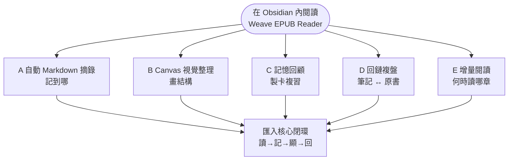
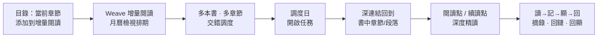

# Weave EPUB Reader

[简体中文](./README.zh-CN.md) | [English](./README.md#english-documentation) | [日本語](./README.ja.md) | [한국어](./README.ko.md) | [Русский](./README.ru.md)

---

## 外掛介紹

如果你希望 **Obsidian 不只是筆記倉庫，也是你正經讀書的地方**，可以試試 Weave EPUB Reader。

它適合：邊讀邊把句子記進 Markdown 的人；做專題研究、想把摘錄畫進 Canvas 的人；用 Weave 做間隔複習、想把書中段落製成卡片的人；同時推進多本書、需要月曆排期而不是「開十本讀半頁」的人。

上手很輕：把 EPUB 放進 Vault，從書架開啟，選中文字即可摘錄。摘錄會帶著回到原書的位置資訊；你改筆記、刪摘錄或換顏色，書裡的高亮也會跟著變。更完整的五條工作流（自動摘錄、Canvas、製卡、回鏈、增量閱讀）見下方 [摘錄筆記工作流](#摘錄筆記工作流) 圖示——按自己的習慣選一條路走即可。

## 核心能力

- **支援平台**：桌面端（Windows、macOS、Linux）與行動端（iOS、Android）
- **介面語言**：简体中文、繁體中文、English、日本語、한국어、Русский（預設跟隨 Obsidian，可在閱讀器設定中固定）
- **閱讀格式**：Vault 內 EPUB、MOBI、AZW3、FB2、FBZ（`fb2.zip`）、CBZ、TXT 等（名稱含 EPUB，但不僅限於 EPUB）
- **摘錄筆記**：五種高亮顏色，以及底線、刪除線、波浪線等樣式標註；想法；自動或手動寫入 Markdown / Canvas / Weave 牌組；正文回顯；筆記刪改、改色後書中高亮同步更新
- **雙向溯源與定位**：書籍深連結錨點；筆記跳回原文段落；閱讀器內點擊高亮反查來源筆記 / Canvas / 牌組
- **段落閱讀模式**：單段沉浸閱讀、段內翻頁與跨段導覽
- **其它**：書架與目錄、分頁/連續捲動、版式主題；閱讀進度與剩餘時間估算；增量閱讀月曆排期；註腳浮窗；書籤、章節匯出、截圖、Canvas 綁定；AI 入口

各能力在 [基礎體驗與進階支援](#基礎體驗與進階支援) 中的劃分見下表。

最低 Obsidian 版本：**1.8.7**

## 摘錄筆記工作流

下方圖示概括整體結構（GitHub / Obsidian 均可渲染 Mermaid）。

### 圖 1 · 五條工作流怎麼選（按目標分流）

中心是「在 Obsidian 內讀書」；向外是按目標選擇的五條典型路徑。

### 圖 2 · 增量閱讀子流程（工作流 E）

解決「**多本書如何交錯推進、長書如何按章深度讀**」，與自動摘錄（工作流 A）互補：**E 管排期，A 管記下什麼**。

### 五條典型工作流

#### A. 自動 Markdown 摘錄（最常用）

適合「邊讀邊記、筆記就是主戰場」：

1. **先**開啟一本 Markdown 作為摘錄筆記本，游標放在要插入的位置（與閱讀器分屏體驗最佳）。
2. 開啟閱讀器，開啟工具列 **自動模式**（閃電圖示：開 = 插入，關 = 複製到剪貼簿）。
3. 在書中選中文字並摘錄 → 帶定位的摘錄區塊（含書籍深連結）**自動插入到上一步游標處**。
4. 儲存筆記後，再次開啟該書，正文會在對應段落**回顯高亮**——你在筆記裡記過什麼，開啟書就能看見。

#### B. Canvas 視覺整理

適合「做專題、畫結構、理清論點關係」：

1. 為當前書**綁定**一個 Canvas 檔案。
2. 開啟自動模式後，摘錄可**自動寫入 Canvas 新節點**（可調整節點排布方向）。
3. 在 Canvas 裡拖曳、連線、分組；閱讀器識別綁定 Canvas 中的摘錄並**回顯到正文**。

#### C. 記憶回顧

適合「摘錄之後要複習、要間隔重複」：

1. 選中文字 → 工具列 **製卡**，進入 Weave 記憶卡片視窗。
2. 儲存到 `.wdeck` 等牌組檔案後，閱讀器從牌組資料**回顯高亮**。
3. 在 Weave 記憶模組中按牌組規則做複習；需要時仍可回到書中原文。

#### D. 回鏈複盤

適合「先摘錄、後複習、再回原文」：

1. 在 Markdown / Canvas / 牌組筆記裡檢視歷史摘錄；開啟書時正文側已有**回顯高亮**。
2. 點擊筆記中的書籍深連結 → 跳回**原文段落**。
3. 在閱讀器裡點擊某條高亮 → **一鍵定位到來源筆記**，完成「筆記 ↔ 原書」雙向溯源。

#### E. 增量閱讀：多書交錯與深度精讀

適合「**不想一次讀完一本**、而是多本書按節奏交錯推進，並在月曆裡看見整體閱讀計畫」：

1. **把當前章節加入增量閱讀**：在閱讀器側邊欄 **目錄** 中，對某一章使用 **「添加到增量閱讀」**（可選擇一個增量閱讀專題），將該章納入增量閱讀任務。
2. **進入月曆檢視統一調度**：章節會出現在 Weave **增量閱讀月曆檢視** 中，與來自其他書籍、其他章節的閱讀點一起排期——實現 **多本書的交錯閱讀**，而不是在書架裡同時開很多本卻都讀不深。
3. **深度閱讀而非淺嚐輒止**：  
   - 選中文字 → 建立 **增量閱讀點**（保留 EPUB 溯源深連結），把段落級內容納入後續處理；  
   - 閱讀過程中可標記 **增量閱讀續讀點**，下次從增量閱讀流程**一鍵回到書中精確位置**繼續。  
4. 到調度日時，從月曆或任務列表開啟對應項 → 經深連結回到原書章節/段落，與摘錄、回鏈工作流銜接。

這與工作流 A（邊讀邊記）互補：**A 解決「記到哪」；E 解決「何時讀哪一章、多本書如何輪流推進」**。

### 和「只用外部閱讀器 + 手動貼上」相比

- **少一次上下文切換**：不必為了記一句而離開 Obsidian。
- **摘錄可沉澱、可檢索**：內容在 Vault 的 Markdown / Canvas / 牌組裡，而不是散落在剪貼簿歷史裡。
- **複習時原文仍在場**：筆記是索引，書是現場；兩者透過深連結與正文回顯連在一起。
- **多端一致**：書與筆記都在 Vault 裡，隨 Obsidian 同步策略走；手機讀、桌面整理可以同一條鏈路。
- **長書與多書有節奏**：章節可進入增量閱讀月曆，按調度交錯閱讀，而不是靠意志力硬啃單本。

## 基礎體驗與進階支援

| 能力 | 基礎體驗 | 進階支援 |
|------|:--------:|:--------:|
| **全平台**閱讀（桌面端與行動端） | ✅ | ✅ |
| 閱讀 **EPUB**，目錄跳轉、翻頁/捲動、版式與主題 | ✅ | ✅ |
| 閱讀 **TXT** 純文字書籍 | ✅ | ✅ |
| 閱讀 **MOBI / AZW3 / FB2 / FBZ / CBZ** | 🔒 | ✅ |
| **五種高亮色**、想法、摘錄與**正文回顯** | ✅ | ✅ |
| **底線 / 刪除線 / 波浪線**等樣式標註 | 🔒 | ✅ |
| **雙向溯源**（錨點跳轉、筆記 ↔ 原書定位顯示） | 🔒 | ✅ |
| **段落閱讀模式**、參考閱讀點 | 🔒 | ✅ |
| **閱讀進度**持久化、書架進度、最後閱讀點、剩餘閱讀時間 | ✅ | ✅ |
| **當前頁書籤**、書籤目錄與書籤列表跳轉 | ✅ | ✅ |
| **Canvas** 綁定與自動寫入節點 | 🔒 | ✅ |
| 註腳浮窗預覽、匯出當前章節為 Markdown | 🔒 | ✅ |

> 圖例：✅ 已包含 · 🔒 需啟用進階支援

- **啟用進階支援**：在閱讀器設定中使用 EPUB 獨立啟用碼；若已安裝並啟用 **Weave 主外掛**，可繼承授權而無需重複輸入。
- **製卡 / 增量閱讀 / AI**：不單獨占用閱讀器進階支援許可，但需安裝 Weave；AI 另需自行設定 API Key。

完整對照見上文 [基礎體驗與進階支援](#基礎體驗與進階支援)；啟用在閱讀器設定中完成，條款見 [PREMIUM_TERMS.md](./PREMIUM_TERMS.md)。

## 安裝

### 方式一：社群外掛（推薦）

1. 開啟 **設定 → 社群外掛 → 瀏覽**
2. 搜尋 **Weave EPUB Reader**，安裝並啟用

### 方式二：手動安裝

1. 從 [GitHub Releases](https://github.com/zhuzhige123/obsidian-weave-reader/releases) 下載與 `manifest.json` 版本號一致的發布包，取得：
   - `main.js`
   - `manifest.json`
   - `styles.css`
2. 複製到 `.obsidian/plugins/weave-epub-reader/`
3. 重新啟動 Obsidian，在 **設定 → 社群外掛** 中啟用 **Weave EPUB Reader**

## 快速開始

1. 啟用外掛後，透過功能區圖示或命令面板開啟**書架**，從 Vault 匯入或開啟圖書。
2. 在閱讀器中選中文字，建立高亮、摘錄或書籤。
3. 使用工具列進行章節跳轉、顯示設定與匯出。
4. 閱讀器選單 → **幫助** → **使用教程** 可檢視外掛內精簡教程。工作流細節見上文 [摘錄筆記工作流](#摘錄筆記工作流)。

## 資料與同步

**建議同步（位於 Vault）**：圖書檔案、Markdown 摘錄、Canvas、Weave 牌組資料，以及每本書的進度與書籤專有筆記（預設 `weave/epub-bookmarks/data_*.md`）。

**通常不需跨裝置同步（位於外掛目錄）**：閱讀快取、索引、Canvas 綁定與參考閱讀點等本地狀態。多裝置使用時優先同步 Vault 內容，而非直接同步 `.obsidian/plugins/weave-epub-reader/` 下的快取檔案。

## 隱私與網路

- 閱讀、渲染、摘錄與回鏈等**預設在本地完成**，不會主動上傳 Vault 內容。
- 書架、回鏈與來源定位等功能會在本地列舉 Vault 檔案路徑；複製摘錄或啟用碼時會存取剪貼簿。詳見 [PRIVACY.md](./PRIVACY.md)。
- **進階支援啟用**可能存取許可證服務（啟用碼、電子郵件、裝置指紋摘要等），詳見 [PRIVACY.md](./PRIVACY.md)。
- **AI 功能**會呼叫你自行設定的第三方服務。

## 常見問題

### 正文沒有顯示摘錄高亮？

確認摘錄由本外掛產生、位於 Markdown / Canvas / Weave 牌組檔案中，且開啟的是**同一本書**。來源檔案剛修改時，稍等片刻會自動重新整理。

### 與 Weave 的關係？

**Weave EPUB Reader 可獨立使用**：不安裝 [Weave](https://github.com/zhuzhige123/anki-obsidian-plugin) 主外掛，也能在 Obsidian 裡閱讀 EPUB、管理書架，並完成基礎摘錄與正文回顯。安裝 Weave 後，可額外銜接製卡複習、增量閱讀月曆、AI 選單等能力，並可繼承 Weave 授權以啟用閱讀器進階支援。二者是**可選聯動**，不是硬性依賴。

### 摘錄筆記能否全平台同步？

**支援。** 摘錄落在 Vault 內的 Markdown、Canvas、牌組等檔案中，會隨你使用的 Obsidian 同步方式（官方 Sync、iCloud、網路硬碟同步 Vault 等）在桌面端與行動端之間保持一致。建議同步 Vault 內容；閱讀器快取等外掛目錄資料通常無需跨裝置同步（見上文 [資料與同步](#資料與同步)）。

### 是否支援匯出筆記？

**支援。** 摘錄與高亮相關資料儲存在你的庫內，可在 Obsidian 中直接檢視、編輯與匯出 Markdown；閱讀器也提供章節匯出等能力。**資料預設完全本地化**，不會主動上傳你的 Vault 內容。

### 為何提供進階付費？

進階支援用於**支援持續開發**——讓開發者能長期投入、打磨閱讀與摘錄細節。**基礎體驗免費**，已涵蓋日常閱讀、五色高亮、想法、摘錄與正文回顯等核心能力，上手體驗完整；若你需要多格式、雙向溯源、段落閱讀模式等進階能力，再按需啟用進階支援即可。

### 是訂閱還是買斷？

閱讀器進階支援採用**買斷制**（一次啟用，長期使用，具體以 [進階支援條款](./PREMIUM_TERMS.md) 為準），而非按月訂閱。

### 非 EPUB 格式打不開？

**EPUB 與 TXT** 在基礎體驗中即可閱讀；**MOBI、AZW3、FB2、FBZ、CBZ** 等需啟用進階支援。詳見上文 [基礎體驗與進階支援](#基礎體驗與進階支援)。

### 外掛資料夾名稱？

外掛 ID 為 `weave-epub-reader`，路徑：`.obsidian/plugins/weave-epub-reader/`

## 更多文件

- [外掛介紹（繁體中文）](./README.zh-TW.md)
- [外掛介紹（简体中文）](./README.md#中文文档)
- [Privacy](./PRIVACY.md) · [Premium support terms](./PREMIUM_TERMS.md) · [Support](./SUPPORT.md) · [Security](./SECURITY.md)

## 授權與作者

原始碼基於 [GPL-3.0-or-later](LICENSE) 發布。

- Author: Rabbit (zhuzhige)
- GitHub: https://github.com/zhuzhige123
